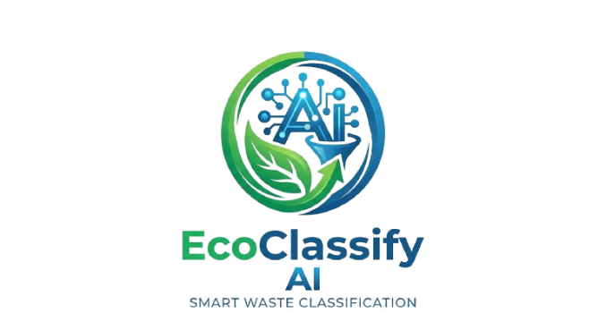

<div align="center">
  

  <h1>♻️ EcoClassify AI</h1>
  
  <p>
    <strong>Automated Garbage Classification & Recycling Guidance Powered by AI</strong>
  </p>
  
  <p>
    <a href="#features">Features</a> •
    <a href="#tech-stack">Tech Stack</a> •
    <a href="#getting-started">Getting Started</a> •
    <a href="#environmental-impact">Environmental Impact</a>
  </p>
</div>

<hr />

## 📖 Overview

**EcoClassify AI** is a smart environmental platform that leverages cutting-edge computer vision (RF-DETR) and generative AI to instantly classify waste items and provide actionable recycling instructions. Simply upload a photo or use your webcam to discover whether an item goes to the blue bin, green bin, or trash, all while tracking your real-world environmental impact over time.

*The classification model powering this platform was trained by **JLNerecina**.*

---

## ✨ Features

- 📸 **Real-Time Classification**: Upload images or capture directly via webcam to analyze waste.
- 🧠 **AI-Powered Analysis**: Utilizes Roboflow's Serverless Workflows and the RF-DETR model for precise object detection.
- 💡 **Smart Recycling Guidance**: Powered by the Gemini API, receive detailed insights on primary categories, material types, and specific bin color recommendations.
- 🌍 **Environmental Impact Dashboard**: Track your cumulative carbon footprint savings, landfill diversion rate, and real-world equivalents (like miles driven avoided or trees saved).
- 📜 **Session History**: Automatically saves your classified items locally so you can review your eco-progress over time.
- ⚙️ **Configurable Workflows**: Easily manage your Roboflow and Gemini API keys via a sleek settings modal.

---

## 🛠️ Tech Stack

### **Frontend**
- **Framework**: React 18 with TypeScript & Vite
- **Styling**: Tailwind CSS
- **Icons**: Lucide React
- **Animations**: CSS Transitions & Tailwind utility classes

### **Backend & AI**
- **Server**: Node.js & Express
- **Computer Vision**: Roboflow Serverless API (RF-DETR Model)
- **Generative AI**: Google Gemini API (`@google/genai` SDK)

---

## 🚀 Getting Started

### Prerequisites
Make sure you have Node.js (v18+) and npm installed.

### Installation

1. **Clone the repository:**
   ```bash
   git clone https://github.com/your-username/ecoclassify-ai.git
   cd ecoclassify-ai
   ```

2. **Install dependencies:**
   ```bash
   npm install
   ```

3. **Set up Environment Variables:**
   Create a `.env` file in the root directory and add your API keys:
   ```env
   GEMINI_API_KEY=your_gemini_api_key_here
   ROBOFLOW_API_KEY=your_roboflow_api_key_here
   ```

4. **Run the Development Server:**
   ```bash
   npm run dev
   ```
   *The app will run locally at `http://localhost:3000`.*

---

## 📊 Environmental Impact Module

The built-in **Impact Dashboard** translates your recycling actions into tangible metrics:
- **CO₂e Savings**: Calculates greenhouse gas emissions avoided by recycling and composting.
- **Diversion Rate**: Shows the percentage of waste kept out of landfills.
- **Equivalents**: Translates savings into understandable figures like smartphone charges, LED light hours, and tree seedlings.

---

## 🤝 Contributing

Contributions are welcome! Feel free to open an issue or submit a pull request if you'd like to improve the platform, add new features, or optimize the existing models.

---

<div align="center">
  <p>Built with ❤️ for a greener planet.</p>
  <p><b>Model trained by JLNerecina</b></p>
</div>
